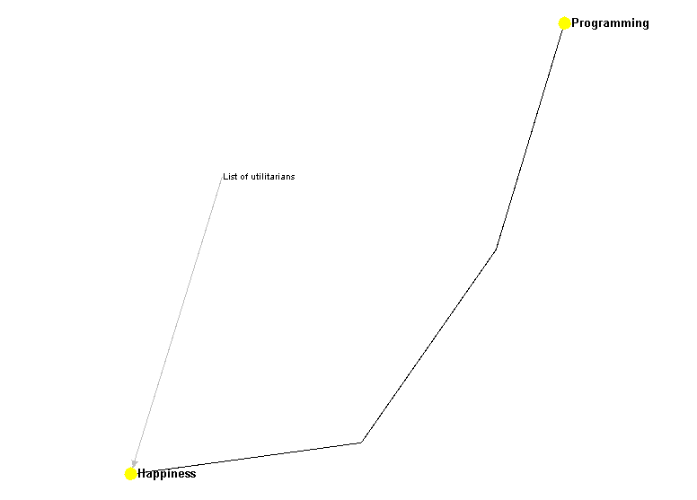
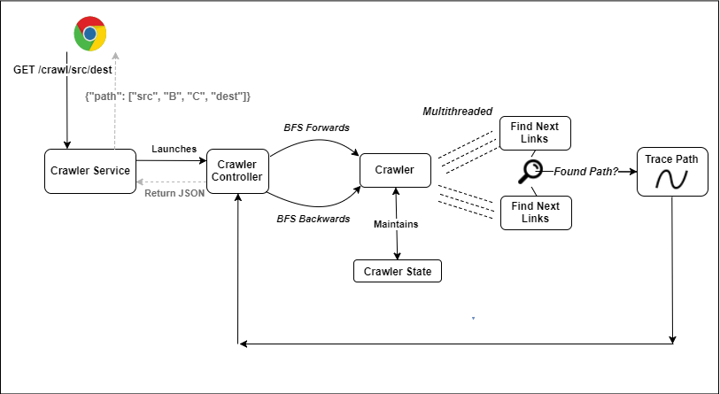
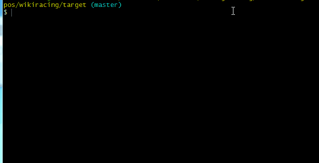
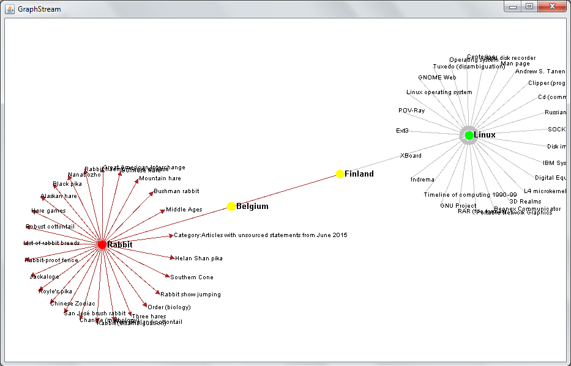

# Wikiracer 
## Overview 
[Wikiracing](https://en.wikipedia.org/wiki/Wikiracing) is a popular game in which players try to navigate as quickly as possible from one Wikipedia page to another. 

Below is a path from Programming to Happiness:



To find this path, the Wikiracer prgram starts a breadth-first search at both the start page and destination page. As soon as it finds an intersection between the two searches, it returns the path.

Given an input sourceTitle and destTitle, Wikiracer offers the following three features:
1. Find path from sourceTitle to destTitle
2. View an animated trace of this path 
3. Expose a REST service to get the path from sourceTitle to destTitle 

Building out all three of these features was extremely fun, particularly in generating an animated trace of the Wikiracer's path. It was satisfying to build out this whole service, not only implementing a bidirectional BFS search algorithm, but also building out a REST API and neat graph visualizations.


## Architecture
The Wikiracer breaks down into the following well-defined components:
* __Crawler__
  * _Crawler Service_: REST service
  * _Crawler Controller_: Orchestrates the bidirectional crawl from source and from destination 
  * _Crawler State_: Maintains links seen so far in memory. Can be switched to a database in the future 
  * _Crawler Result_: Stores path and stats
* __Path__: Traces the path when the crawler finds an intersection between the two breadth-first searches 
* __WikiRetriever__: Encapsulates calls to the [MediaWiki API](https://www.mediawiki.org/wiki/API:Query)
* __WebNode__: Data structure encapsulating a link
* __Visualizer__: Visualizes the path 

Below is a diagram of how a GET call to the Wikiracer REST service is passed down through these components.




## Usage
Clone this repository onto your local machine, then run the following install commands. This will build and run all package tests (unit tests and end-to-end tests for the Wikiracer).
```linux
cd wikiracer
mvn clean install
```

Alternatively, if you do not wish to use Maven, you can clone the repository, then execute the following commands to test the code:
```Linux
cd wikiracer
make test
```

You can now run the crawler as follows:
```
java -jar wikiracing-1.0-SNAPSHOT-jar-with-dependencies.jar -sourceTitle Programming -destTitle Happiness 
```

The path and pertinent stats will print to standard out.



You can also specify an optional timeout parameter (s) for terminating the crawl.
```linux 
java -jar wikiracing-1.0-SNAPSHOT-jar-with-dependencies.jar -sourceTitle Programming -destTitle Happiness -timeout 1
```

Finally, after the crawler has found the path between sourceTitle and destTitle, you'll see the GraphStream animation trace automatically pop up.



__Legend__<br>
* _Brown Edges_: These were traced going forwards from the sourceTitle
* _Gray Edges_: These were traced going backwards from the destTitle
* _Yellow Nodes_: These lie along the path connecting sourceTitle (_colored red_) to destTitle (_colored green_)

__Note__: To make the animation readable, I show up to 25 visited pages going out from the startTitle and destTitle. In addition, nodes are traced in BFS order, but order is not guaranteed within a given level. This animation could be further enhanced to allow the user to drilldown into all visited pages (typically upwards of 2000+ pages).

### REST Service
To start the REST service, simply add an extra parameter:
```linux
java -jar wikiracing-1.0-SNAPSHOT-jar-with-dependencies.jar -startREST Y
```

If you're running this on your local machine, fire up a browser and go to localhost:4567. The Wikiracer REST service offers two endpoints:
* GET /crawl/sourceTitle/destTitle 
* GET /crawl/sourceTitle/destTitle/timeout

Alternatively, you can [click on this link](http://ec2-52-39-21-29.us-west-2.compute.amazonaws.com:4567/crawl/apple/orange) to access the EC2 that I already set up to run this REST service.

Below is an example response, which shows the path found by the crawler as well as basic stats:
```javascript 
{
  "status": "SUCCESS",
  "data": {
    "foundPath": "Y",
    "info": "Found path!",
    "path": [
      "Apple",
      "Agriculture",
      "Garden design",
      "Chair"
    ],
    "runtimeMillis": 1154,
    "algorithm": "Bidirectional BFS",
    "numThreads": 16,
    "batchSize": 50
  }
}
```
In case of a timeout failure, you'll receive the below response. Note that "status" indicates whether the REST GET was successful, but "data"-->"foundPath" indicates whether the crawler successfully found path in the allotted time.
```javascript 
{
  "status": "SUCCESS",
  "data": {
    "foundPath": "N",
    "info": "Failed to complete within timeout period of 1s",
    "runtimeMillis": 1001,
    "algorithm": "Bidirectional BFS",
    "numThreads": 16,
    "batchSize": 50
  }
}
```

## Considerations in Code Design
### Designing Code to Scale
For this build I did not set up a persistent back-end database; rather, I maintained in memory all of the necessary data structures (e.g. queue tracking nodes to visit, hash map tracking visited nodes). Along with the multi-threading enhancements discussed below, I achieved sufficient performance using these in-memory data structures.

However, I intentionally abstracted out the CrawlerState class to allow for additional scaling in the future. That is, no methods outside CrawlerState directly touch the actual queue/hash map implementations. Rather, they must interact with the database through the CrawlerState's API.

Hence, if I were to further scale this service (e.g. add boxes to scale horizontally), it would be a relatively painless task to simply update the CrawlerState methods to interact with whatever database (e.g. Redis).

### Multi-Threading 
I originally implemented this bidirectional BFS along a single thread. The program first visited the Wiki page for the source title, then added any links on that page to a queue of titles to visit. It then dequeued the next set of titles to visit, called the Wiki API on these titles, added these latest new links to the queue, and so on.

Based on my testing, the slowest part was in waiting for the Wiki API to return a response. Since the Wiki API permits batching, I achieved some performance gains by requesting a response for batches of 50 titles--instead of making requests on one title at a time.

To further improve this, I decided to spawn multiple threads making API requests. So, the program had to pull off as many batches as possible from the queue of titles to visit. Each batch could be sent to a separate thread, which would then submit that batch to the Wiki API. As each request returned, the corresponding thread would add the latest discovered links to the queue.
```java
	// generate the pool of threads 
	ExecutorService taskExecutor = Executors.newFixedThreadPool(threads);
	
	// example task to run on a given thread
	Runnable task = new Runnable() {
		public void run() {
			if (!path.foundPath()) {
				findNextLinks(crawlerState.getNextBatchToVisit(direction), direction);
			}
		}
	};
	taskExecutor.execute(task);
```		
There were also additional complexities with multi-threading, including:
* Managing synchronization of the queue (since multiple threads were writing to it)
* Ensuring that all threads returned _as soon as possible_ when any thread discovered the path between source and destination title 
* Ensuring that all threads terminated gracefully

### REST API
I implemented my REST API using the Java Spark framework. Currently, it offers the following two endpoints, which were discussed up above:
* GET /crawl/sourceTitle/destTitle 
* GET /crawl/sourceTitle/destTitle/timeout

In terms of future improvements, I would implement additional endpoints for benchmarking:
* GET /benchmarking
* GET /benchmarking/sourceTitle/destTitle 
* GET /benchmarking/sourceTitle/destTitle/algorithm 
* GET /benchmarking/sourceTitle/destTitle/algorithm/maxBatchSize/numThreads
* GET /benchmarking/sourceTitle/destTitle/algorithm/maxBatchSize/numThreads

The first benchmarking endpoint would run the crawler multiple times on a predetermined set of Wiki pages in order to collect stats on execution time, CPU usage, search depth, etc. These stats would be cut by variables like the maxBatchSize (how many titles are pulled off the queue at each step) and numThreads (how many threads are spawned to handle the Wiki API calls).

The other endpoints could afford the user additional control over these tests. For example, perhaps they only want to benchmark one specific path--or perhaps they want to benchmark against __unidirectional__ BFS (one could easily implement this by removing execution of the taskBackwards in CrawlController).

Finally, varying the batch size and number of threads could help further improve performance. Currently, my Wikiracer assumes that it is optimal to call as many titles as possible in one batch call to the Wiki API (which caps batch size at 50 titles). However, since the Wiki API only _returns_ a maximum of 500 links at a time, calling the API with 50 new titles may force one single thread to sequentially call the API until it receives links for all 50 titles. Hence, performance could improve as batch size increases to 25 titles--but decrease from then on.

### Other Enhancements 
__Additional Tests__<br> 
Mvn clean install executes unit tests on my Crawler and WikiRetriever classes, as well as end-to-end tests on the Crawler. These tests validate the core functionality of the program. 

I would like to write additional tests for my Wikiracer, specifically:
1. Test that the addAllPagesToVisit method (and the methods it calls) correctly pulls out all links returned by the Wiki API 
2. Test that the crawler executes as expected even when multiple crawlers are started
 
While I informally tested these during development, I would like to supplement my existing tests with additional code to rigorously test the above two features.

__Page Redirects__<br>
Secondly, the Wikiracer may not perfectly handle all cases--for example, if the user inputs a page that redirects, the Wikiracer may never find the original destination title since that title will always redirect to a differently named page.

This could potentially be fixed in two ways. First, I could test using the "redirects" parameter that the Wiki API offers ([see documentation here](https://www.mediawiki.org/wiki/API:Query#Resolving_redirects)).

Alternatively, I could use the redirected page as the actual title requested by the user. For example, if the user inputs "Pomaceous" as the destination, this would redirect to Pome, and I would use Pome as the destination title (rather than Pomaceous). This code update would be implemented in the Utils.normalizeTitle method, since that already functions to clean up the casing of the user's inputted titles. 
 
## Project Timeline 
Finally, below is a summary of my project timeline and effort.
* __1 hour__: Research algorithms for wikiracing (e.g. breadth-first search, A* algorithm, precomputing, running a topical search based on human domain knowledge). Sketched out high-level code for BFS algorithm
* __1 hour__: Tested the Wiki API, set up class to handle these HTTP requests
* __2 - 3 hours__: Built unidirectional breadth-first search and tested performance (extremely slow, with queries taking upwards of 10 seconds)
* __2 hours__: Revised crawler to run bidirectional search 
* __2 - 3 hours__: Set up multithreading and debugged synchronization issues
* __1 hour__: Added unit tests and end-to-end tests
* __1 hour__: Refactored code, splitting out classes into logical components
* __1 hour__: Set up REST API and deployed to EC2 
* __1 - 2 hours__: Learned how to use the GraphStream module, then built out the animated trace 
* __1 - 2 hours__: Created writeup and cleaned up code

